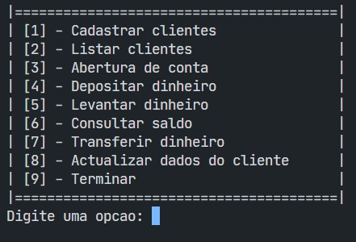

# sig-BAI-C

This document is also available in [Portuguese](./docs/README-pt-AO.md).

## What is

This is an implementation of the [management system simulation](https://github.com/isaf2022/sig-BAI) using C for the [BAI (Banco Angolano de Investimentos)](https://www.bancobai.ao/pt/particulares).

## Motivation

The motivation for this repository is a school project where the goal is to simulate some of the operations done in BAI using concepts of algorithms. This is done in C, a powerful and portable language. This is only for educational purposes and couldn't or shouldn't be used in production.

## Specs

1. The system needs to be capable of storing data in memory making use of arrays, and also needs to apply all the concepts related to algorithms that were learned.

2. It needs to have the following functionalities:

  - Client registration
  - Bank account creation
  - Money deposit
  - Cash withdrawal
  - Check balance
  - Transfer money
  - Update personal information
  - List customers
  - Backup
  - And Restore

3. It should give the user a menu to choose among the above functionalities. Something like this:

### Contrib

If you find a bug, please open an issue on [issues section of this repository](https://github.com/isaf2022/sig-BAI-C/issues) on Github, or you could open a [pull request](https://github.com/isaf2022/sig-BAI-C/pulls) to suggest modifications and improovements.
