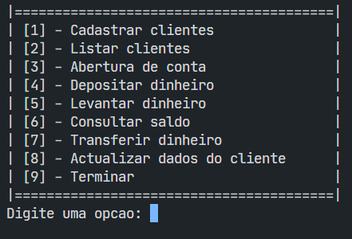

# sig-BAI-C

Este documento também está disponível em [Inglês](../README.md).

## O que é

Esta é uma implementação da [simulação de sistema de gestão](https://github.com/isaf2022/sig-BAI) usando C para o [BAI (Banco Angolano de Investimentos)](https://www.bancobai.ao/pt/particulares).

## Motivação

A motivação para este repositório é um projeto escolar onde o objetivo é simular algumas das operações feitas no BAI utilizando conceitos de algoritmos. Isso é feito em C, uma linguagem poderosa e portátil. Isto é apenas para fins educacionais e não pode ou não deve ser usado na produção.

## Especificações

1. O sistema precisa ser capaz de armazenar dados em memória fazendo uso de arrays, e também precisa aplicar todos os conceitos relacionados aos algoritmos que foram aprendidos.

2. Deve ter as seguintes funcionalidades:

   - Cadastro de cliente
   - Criação de conta bancária
   - Depósito de dinheiro
   - Retirada de dinheiro
   - Verificar saldo
   - Transferir dinheiro
   - Atualizar informações pessoais
   - Listar clientes
   - Cópia de segurança
   - E restaurar

3. Deve fornecer ao usuário um menu para escolher entre as funcionalidades acima. Algo assim:

### Contribuir

Se você encontrar um bug, abra um problema na [seção de problemas deste repositório](https://github.com/isaf2022/sig-BAI-C/issues) no Github, ou você pode abrir uma [solicitação pull]( https://github.com/isaf2022/sig-BAI-C/pulls) para sugerir modificações e melhorias.
​